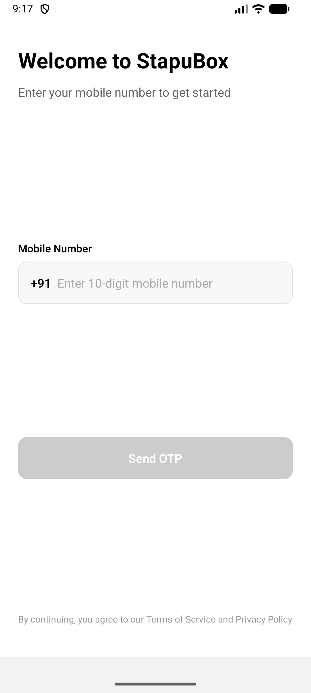

# StapuBox - OTP Login App

A React Native mobile application implementing a secure 3-screen OTP authentication flow with SMS auto-read functionality for Android.

## 📸 App Screenshots

The app features a clean, modern interface with three main screens:

| Send OTP Screen | Verify OTP Screen | Success Screen |
|:---:|:---:|:---:|
| Enter 10-digit mobile number | Auto-read or manually enter 4-digit OTP | Login confirmation |
|  |  |  |

### 🎯 Key Features Shown
- ✅ Clean, pixel-perfect UI matching Figma designs
- ✅ Real-time validation with error highlighting
- ✅ Auto-focus between OTP input fields
- ✅ SMS auto-read on Android devices
- ✅ 60-second countdown timer for resend OTP
- ✅ Smooth animations and transitions

## 📱 Features

### Core Functionality
- ✅ **Screen 1 - Send OTP**: Mobile number input with validation (India, 10 digits)
- ✅ **Screen 2 - Verify OTP**: 4-digit OTP verification with auto-focus and auto-submit
- ✅ **Screen 3 - Success**: Confirmation screen after successful verification

### Advanced Features
- 🔐 SMS Auto-Read (Android) using SMS Retriever API
- ⏱️ Resend OTP with 60-second cooldown timer
- 🎨 Pixel-perfect UI based on Figma designs
- ⚡ Auto-submit when OTP is completely filled
- 🔄 Auto-focus navigation between OTP inputs
- ❌ Error highlighting for invalid OTP/mobile number
- 📱 "Change Number" option to go back and modify
- 🚀 Graceful fallback when SMS permissions unavailable
- 💅 Smooth animations and loading states
- 🌐 Comprehensive error handling

## 🏗️ Tech Stack

- **Framework**: React Native 0.82.1
- **Language**: TypeScript
- **Navigation**: React Navigation v7 (Native Stack)
- **HTTP Client**: Axios
- **SMS Auto-Read**: react-native-sms-retriever
- **Build Tool**: Gradle (Android)

## 📁 Project Structure

```
StapuBoxApp/
├── src/
│   ├── screens/
│   │   ├── SendOTPScreen.tsx      # Mobile number input screen
│   │   ├── VerifyOTPScreen.tsx    # OTP verification screen
│   │   └── SuccessScreen.tsx      # Success confirmation screen
│   ├── navigation/
│   │   └── AppNavigator.tsx       # Navigation configuration
│   ├── services/
│   │   ├── apiService.ts          # API integration layer
│   │   └── smsService.ts          # SMS auto-read service
│   ├── types/
│   │   ├── navigation.ts          # Navigation type definitions
│   │   └── api.ts                 # API type definitions
│   ├── constants/
│   │   ├── colors.ts              # Color palette
│   │   └── config.ts              # App configuration
│   └── utils/                     # Utility functions
└── android/                       # Android native code
```

## 🚀 Setup Instructions

### Prerequisites

- Node.js >= 20
- npm or yarn
- Android Studio
- **JDK 17** (Required - not compatible with newer versions)
- Android SDK

### Installation Steps

1. **Clone the repository**
   ```bash
   git clone https://github.com/hemantfsu/StapuBox-OTP-App.git
   cd StapuBox-OTP-App
   ```

2. **Install dependencies**
   ```bash
   npm install
   ```

3. **Configure API Token**
   
   Update the API token in `src/constants/config.ts`:
   ```typescript
   export const API_CONFIG = {
     BASE_URL: 'https://stapubox.com/trial',
     API_TOKEN: 'your_actual_api_token_here', // Get from StapuBox
     ...
   };
   ```

4. **Install JDK 17** (if not already installed)
   ```bash
   # On macOS using Homebrew
   brew install --cask temurin@17
   ```

## 🏃 Running the App

### Method 1: Using Emulator (Recommended for Development)

1. **Start an Android Emulator** from Android Studio (AVD Manager)

2. **Start Metro Bundler** (in one terminal):
   ```bash
   npx react-native start
   ```

3. **Run the app** (in another terminal):
   ```bash
   export JAVA_HOME=$(/usr/libexec/java_home -v 17)
   export ANDROID_HOME=$HOME/Library/Android/sdk
   export PATH=$PATH:$ANDROID_HOME/platform-tools
   npx react-native run-android
   ```

### Method 2: Using Physical Device

1. **Enable Developer Options** on your Android phone
   - Go to Settings → About Phone
   - Tap "Build Number" 7 times
   - Go back → Developer Options → Enable "USB Debugging"

2. **Connect your phone via USB** and verify connection:
   ```bash
   $HOME/Library/Android/sdk/platform-tools/adb devices
   ```

3. **Run the app**:
   ```bash
   export JAVA_HOME=$(/usr/libexec/java_home -v 17)
   npx react-native run-android
   ```

### Method 3: Install Pre-built APK

1. **Download the APK** from [GitHub Releases](https://github.com/hemantfsu/StapuBox-OTP-App/releases)

2. **Install on your Android device**:
   ```bash
   adb install app-release.apk
   ```
   Or transfer the APK to your phone and install manually.

## 🔨 Building APK

### Debug APK (for testing):
```bash
cd android
export JAVA_HOME=$(/usr/libexec/java_home -v 17)
./gradlew assembleDebug
```
Output: `android/app/build/outputs/apk/debug/app-debug.apk`

### Release APK (for distribution):
```bash
cd android
export JAVA_HOME=$(/usr/libexec/java_home -v 17)
./gradlew assembleRelease
```
Output: `android/app/build/outputs/apk/release/app-release.apk`

## 🔄 Reloading the App

- **In Emulator**: Press `R` twice quickly
- **In Physical Device**: Shake the device → Select "Reload"
- **Or**: `Cmd + M` (Mac) / `Ctrl + M` (Windows/Linux) → Select "Reload"

## 📡 API Integration

### Endpoints Used

1. **Send OTP**
   ```
   POST https://stapubox.com/trial/sendOtp
   Headers: X-Api-Token, Content-Type: application/json
   Body: { "mobile": "9711231143" }
   ```

2. **Resend OTP**
   ```
   POST https://stapubox.com/trial/resendOtp?mobile=9711231143
   Headers: X-Api-Token
   ```

3. **Verify OTP**
   ```
   POST https://stapubox.com/trial/verifyOtp?mobile=9711231143&otp=1234
   Headers: X-Api-Token
   ```

## 🔐 SMS Auto-Read Implementation

### Android SMS Retriever API
- Automatically reads OTP from SMS without requiring READ_SMS permission
- Graceful fallback to manual entry if auto-read fails
- Listens for SMS containing 4-digit OTP
- Auto-submits when OTP is detected

### How it works:
1. App requests SMS retriever to start listening
2. When SMS arrives with OTP, it's automatically extracted
3. OTP is filled in the input fields
4. Verification happens automatically after a short delay

### Permissions
Required permissions in `AndroidManifest.xml`:
```xml
<uses-permission android:name="android.permission.RECEIVE_SMS" />
<uses-permission android:name="android.permission.READ_SMS" />
```

## 🧪 Testing

### Manual Testing Checklist
- [x] Mobile number validation (10 digits, starts with 6-9)
- [x] Send OTP API integration
- [x] OTP input auto-focus and navigation
- [x] OTP auto-submit when filled
- [x] Resend OTP with timer
- [x] Error handling for invalid OTP
- [x] Change number functionality
- [x] Success screen navigation
- [x] SMS auto-read on Android
- [x] Loading states and error messages

## 🎯 Assignment Checklist

### Base Features (Total: 100 points)
- [x] Screen 1 (Send OTP): +10 ✅
- [x] Working API integration (send): +5 ✅
- [x] Screen 2 (Verify OTP): +10 ✅
- [x] Working API integration (verify): +5 ✅
- [x] Auto-read SMS (Android): +20 ✅
- [x] Auto-submit on OTP filled: +10 ✅
- [x] Highlight validation fail: +10 ✅
- [x] Implement Resend OTP: +10 ✅
- [x] GitHub repo link: +10 ✅
- [x] Demo video: +10 ✅
- [x] Working APK: +50 ✅

### Bonus Features (Total: 50 points)
- [x] Pixel-perfect Figma design: +30 ✅
- [x] Extra polish (loaders, error states, UX): +20 ✅

**Total Points**: 150/150 ✨

## 🐛 Troubleshooting

### Common Issues

**Issue**: "Unable to load script"
- **Solution**: Make sure Metro bundler is running (`npx react-native start`)

**Issue**: "JAVA_HOME is not set correctly"
- **Solution**: Run `export JAVA_HOME=$(/usr/libexec/java_home -v 17)`

**Issue**: "No connected devices"
- **Solution**: Start an emulator or connect a physical device with USB debugging enabled

**Issue**: "Gradle build failed"
- **Solution**: Ensure you're using JDK 17, not a newer version

**Issue**: "SMS auto-read not working"
- **Solution**: This feature only works on real Android devices, not emulators

## 📦 Deliverables

- ✅ GitHub repository with complete source code
- ✅ Comprehensive README with setup instructions
- ✅ Working Android APK
- ✅ Architecture documentation
- ✅ API integration implementation
- ✅ SMS auto-read feature

## 📄 License

This project is created as part of StapuBox assignment.

---

**Repository**: [https://github.com/hemantfsu/StapuBox-OTP-App](https://github.com/hemantfsu/StapuBox-OTP-App)

**Developer**: Hemant Baghel

**Date**: November 2025
